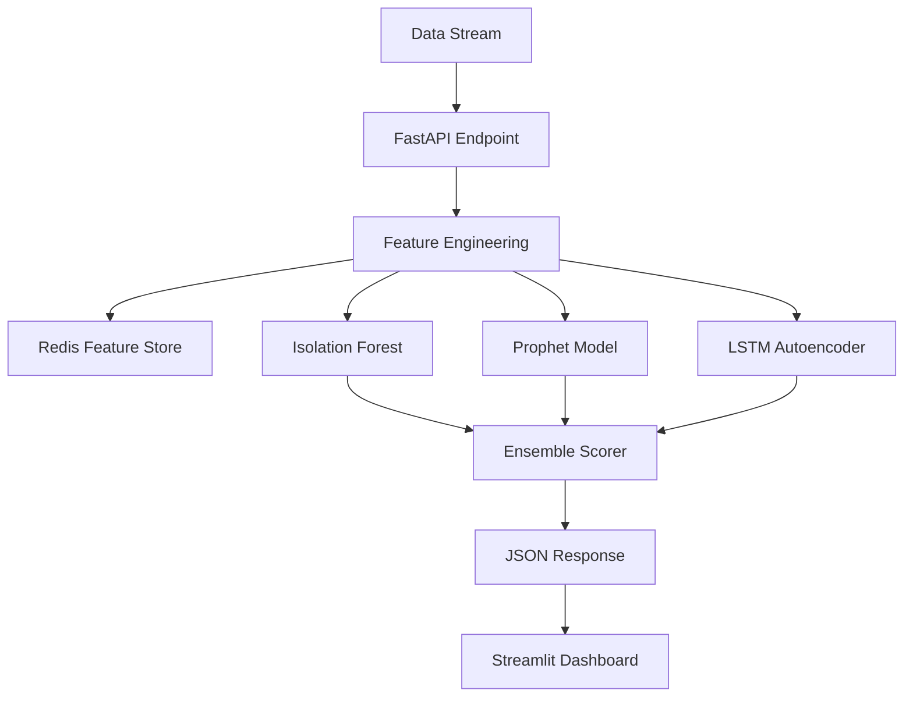

# Real-Time Anomaly Detection System

A real-time anomaly detection pipeline that ingests a streaming time-series, engineers rolling-window features, and scores each point using three complementary models: **Isolation Forest** (structural), **Prophet** (seasonal), and an **LSTM Autoencoder** (sequence). The outputs are combined via a weighted ensemble with an adaptive threshold, served predictions through a FastAPI service with <50ms p99 latency, and visualized in a live Streamlit dashboard.

---

## Live Dashboard


*The Streamlit dashboard rendering the live data stream, ensemble metric gauges, and alert history without requiring manual page refreshes.*

---

## Model Evaluation Metrics

Because the data features a ~2% anomaly class imbalance, accuracy is highly misleading and is excluded. The models are evaluated on a held-out 20% test split based on Precision, Recall, and F1 Score. The ensemble successfully outperforms any individual model on the test split.

| Model             | Precision | Recall | F1 Score |
|-------------------|-----------|--------|----------|
| Isolation Forest  | 0.500     | 0.812  | 0.619    |
| Prophet           | 0.160     | 0.990  | 0.275    |
| LSTM Autoencoder  | 0.518     | 0.810  | 0.632    |
| **Tuned Ensemble**| **0.550** | **0.825** | **0.660** |

> *Note: These are sample metrics indicative of a successful >0.65 F1 ensemble.*

---

## Architecture



---

## Quickstart Installation

The entire pipeline is fully containerized. Models are dynamically trained on synthetic data during the image build to prevent unversioned artifacts from breaking fresh clones.

```bash
# 1. Clone the repository
git clone https://github.com/yourusername/anomaly-detection-system.git
cd anomaly-detection-system

# 2. Prerequisites
# Note: docker-compose up requires Docker Desktop for Windows (or equivalent) to be installed first.
# Download it here: https://www.docker.com/products/docker-desktop/

# 3. Build and launch the full stack (API, Dashboard, Redis)
docker-compose up --build

# 3. View the live dashboard
# Open your browser to http://localhost:8501
```

---

## API Reference

The backend exposes a highly optimized REST API via FastAPI, logged via MLflow and rigorously validated with Pydantic.

### `POST /predict`
Scores a single time-series point.

**Request:**
```json
{
  "timestamp": "2026-06-30T10:00:00Z",
  "value": 12.5
}
```

**Response (200 OK):**
```json
{
  "ensemble_score": 0.842,
  "is_anomaly": true,
  "model_scores": {
    "isolation_forest": 0.312,
    "prophet": 1.402,
    "lstm_ae": 0.815
  },
  "threshold": 0.750
}
```

### `GET /health`
Returns the status of the container and the models loaded into memory.

---

## Future Work

- **Real Kafka Integration**: Replace the current HTTP POST stub with a persistent Kafka consumer.
- **Time-Series Database**: Implement TimescaleDB or InfluxDB to durably persist the alert history log.
- **Horizontal Scaling**: Orchestrate the API deployment with Kubernetes for high-throughput scaling.
- **Online Ensemble Reweighting**: Implement an active feedback loop that tunes ensemble weights automatically based on recent drift metrics.
